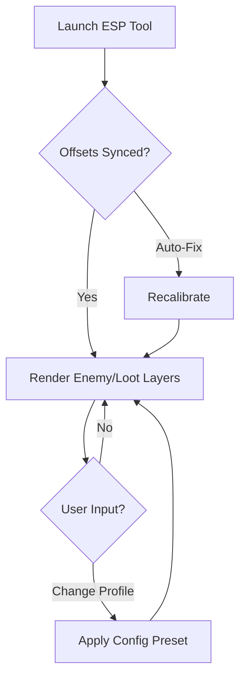

## 🧭 Overview

This ESP suite operates as a modular awareness engine: enemy silhouettes, weak-spot indicators, loot markers, ally positioning rays, and path-flow nudges. Everything is configurable—intensity, distance, color layers, behavior cues—so your screen becomes an extension of instinct rather than clutter.

From early waves to boss finales, the tool illuminates what matters, quiets what doesn’t, and bends the chaos of Killing Floor 3 into a readable rhythm.

---


---

## 🎯 Features

A crystalline map of the battlefield, shaped for clarity and control:

* **Zed Outline ESP**
  Soft silhouettes on all enemy types—trash mobs shimmer lightly, elites burn in stronger tones.

* **Weak-Spot Mark Indicators**
  Optional nodes showing critical zones for Scrakes, Fleshpounds, and specials.

* **Loot & Resource Detection**
  Ammo, grenades, temporary buffs, and rare pickups glow with customizable hue layers.

* **Ally Status Vision**
  Track teammate location, HP, distance, and direction via discreet trailing beams.

* **Wave Pressure Matrix**
  Displays movement density zones so you can rotate or kite more intelligently.

[!IMPORTANT]
Combine only the overlays you truly need—minimalism keeps reaction speed razor-clean.

---

## 🖥 Compatibility

| Component         | Supported                | Notes                        |
| ----------------- | ------------------------ | ---------------------------- |
| **OS**            | Windows 10 / 11          | optimized DirectX runtime    |
| **Game Version**  | Killing Floor 3 (latest) | auto-offset recalibration    |
| **Hardware**      | GTX 900+ or equivalent   | extremely low overhead       |
| **Accessibility** | Colorblind modes         | adjustable brightness curves |

---

## ⚡ Setup & Configuration

Slip your awareness upgrade into the carnage with practiced ease:

1. Download the ESP bundle via the badges above.
2. Extract into a dedicated directory.
3. Run the launcher as admin to initialize overlay hooks.
4. Start with a balanced starter profile:

   ```ini
   [awareness]
   zed_glow = 0.55
   elite_intensity = 0.75
   loot_distance = 140
   teammate_beams = true
   pressure_map = minimal
   ```
5. Press `F8` in-game to open the ESP tuning menu.

[!NOTE]
If you play on ultrawide resolutions or curved monitors, increase overlay scale by 10–15% for crisp spacing.

---

## 🌿 Mermaid Diagram — ESP Runtime Flow



---

## 🔧 Additional Capabilities

* Dynamic fade-in intensity on spawning Zeds.
* Corridor-compression alerts for tight maps.
* Ammo scarcity filter—highlights only needed ammo types.
* Hotkeys:

  * `ALT + E` — toggle enemy outlines
  * `CTRL + P` — pressure heatmap toggle
  * `SHIFT + L` — loot-only mode
  * `CTRL + 7` — profile rotation

### Visual Themes

* **Biohazard Green**
* **Inferno Red**
* **Arctic Blue**
* **Nocturne Violet** (minimalist mode)

[!WARNING]
High outline thickness may cause visual noise during boss fights—keep glow values balanced.

---

## 📊 Advanced Configuration Tips

### Elite Control Build

For Scrake/Fleshpound-heavy waves:

```ini
elite_intensity = 0.85
weakspot_markers = true
pressure_map = medium
loot_distance = 100
zed_glow = 0.40
```

### Survivalist Solo Build

For lone-wolf runs:

```ini
zed_glow = 0.65
loot_scan = true
teammate_beams = false
pressure_map = high
weakspot_markers = false
```

### Team Support Highlight

Ideal for medics and supports:

```ini
teammate_beams = true
ally_status = full
zed_glow = 0.35
loot_distance = 120
pressure_map = off
```

---

## ❓ FAQ — Echoes from the Killing Floor

**Q: Does this modify difficulty or wave scaling?**
A: No—ESP is visual-only and never interacts with internal game logic.

**Q: Can I export and import profiles?**
A: Yes, all profiles are saved as `.cfg` files.

**Q: Is FPS impact noticeable?**
A: Very minimal; optimized for large-horde scenarios.

**Q: Does it work across all maps?**
A: Fully—indoor, outdoor, and multi-layer maps all supported.

**Q: Can each ESP layer be toggled independently?**
A: Absolutely—every feature is modular.

---

## 🌙 Final Thoughts

In the furnace of Killing Floor 3’s arenas, survival depends on insight—what moves, what hides, what threatens, what saves. The **Killing Floor 3 ESP** tool doesn’t replace instinct… it *amplifies* it. Let the silhouettes breathe around you, let loot gleam like tiny mercies, and let your awareness sharpen into something almost supernatural.

---
